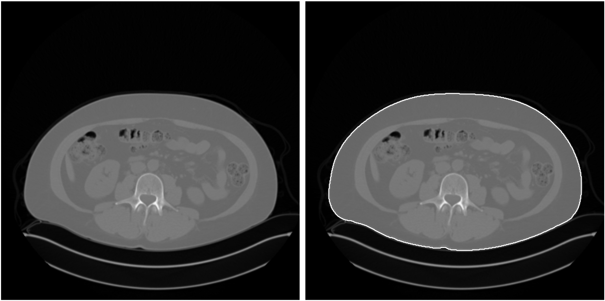

# CTContour

This code implements the processing pipeline described in the article:

Pace E, Caruana CJ, Bosmans H, Cortis K, D’Anastasi M, Valentino G. 
CTContour: An open-source Python pipeline for automatic contouring and calculation of mean SSDE along the abdomino-pelvic region for CT images; validation on fifteen systems. 
Physica Medica 2022;103:190–8. https://doi.org/10.1016/j.ejmp.2022.10.027.




## Overview

CTContour is a free, open-source (GNU GPLv3) tool for fully automated patient abdomino-pelvic trunk contouring 
(or segmentation) for the purposes of SSDE calculation.

CTContour: 

1.  has been validated on publicly available datasets (from [The Cancer Imaging Archive](https://www.cancerimagingarchive.net))
2.  Tests individual slices for truncation artefacts (so these may be omitted from mean SSDE calculation)
3.  is written for bulk image processing (~65 slices/s on a 6-core system)
4.  Provides various visual outputs: before/after; individual steps; truncated regions
5.  Provides data tables (CSV) with a record for each slice that includes area, MPV, WED, SSDE
6.  Provides a boolean mask (NPZ) of the patient contour, to permit further analysis


## Installation

CTContour is available on [Github](https://github.com/ericpace/ctcontour) and [PyPI](https://pypi.org/project/ctcontour/).

### Requirements
This is a pure Python tool and requires Python 3.8+. 
Installation of this tool will automatically install the below libraries:

```commandline
pydicom==2.1.2
numba==0.52.0
scipy==1.4.1
scikit-image==0.18.2
pandas==1.2.1
matplotlib==3.3.4
seaborn==0.11.1
PyPDF2==1.26.0
```


### Installing using pip:

```text
$> python3 -m pip install ctcontour
```

### Installing from wheel:

```text
$> python3 -m pip install /path/to/whl
```


## Usage

If working within a virtual environment, make sure it is activated:


```text
$> source /path/to/python/bin/activate
```

Once the environment is active, you can use the `ctc` entry point:


```text
$> ctc --help

usage: ctc [-h] [--thumbs] [--detail] [--trunk] [--npz] [--csv]
                   [--single] [--recursive] [--merge_pdf] [--merge_csv]
                   Source Destination

Fully automated patient abdomino-pelvic contouring for CT images.

positional arguments:
  Source       Location of source dicom file or folder to contour
  Destination  Destination for results. Should ideally be an empty directory.
               Existing files may be overwritten

optional arguments:
  -h, --help   show this help message and exit
  --thumbs     Save PDF showing original image at left and contoured image at
               right. File saved as *_thumbs.pdf
  --detail     save PDF showing full morphological steps. File saved as
               *_detail.pdf
  --trunk      save PDF showing truncation map. Red for out-of-scan and orange
               for out-of-edge. File saved as *_trunk.pdf
  --npz        save trunk contour to compressed npz file. Uses dictionary key:
               'mask': mask. File saved as *.npz
  --csv        save contour metrics to csv. File saved as *.csv
  --single     No multicore processing (useful for debugging)
  --recursive  Also process subfolders. Generates a list of all subfolders
               before starting.
  --merge_pdf  Merge generated PDFs. By default merges into
               [foldername]_[mask|mask_detail].pdf
  --merge_csv  Merge generated CSVs. By default merges into
               [foldername]_mask.csv
```


### Examples

Contour all images that exist only in `src/` and place output in `dst/`, using all available cores. The output will
be the tabulated results only, with one CSV file per slice:

```commandline
ctc "/user/myuser/images/src/" "/user/myuser/images/dst/" --csv
```

To also process subdirectories, use the `--recursive` flag:

```commandline
ctc "/user/myuser/images/src/" "/user/myuser/images/dst/" --csv --recursive
```

Same as above but merge the CSV files in each folder into a single CSV file. 
This CSV file will have the parent directory name - e.g. if in this case there are images in the top level
directory `dst/`, the results will be merged into `dst.csv`:

```commandline
ctc "/user/myuser/images/src/" "/user/myuser/images/dst/" --csv --recursive --merge_csv
```

You may also opt to save a PDF figure showing thumbnails, morphological details, truncation:
```commandline
ctc "/user/myuser/images/src/" "/user/myuser/images/dst/" --thumbs --detail --trunk
```

As with the CSV files, you can do per-directory merging of PDFs:
```commandline
ctc "/user/myuser/images/src/" "/user/myuser/images/dst/" --thumbs --detail --trunk --merge_pdf
```

